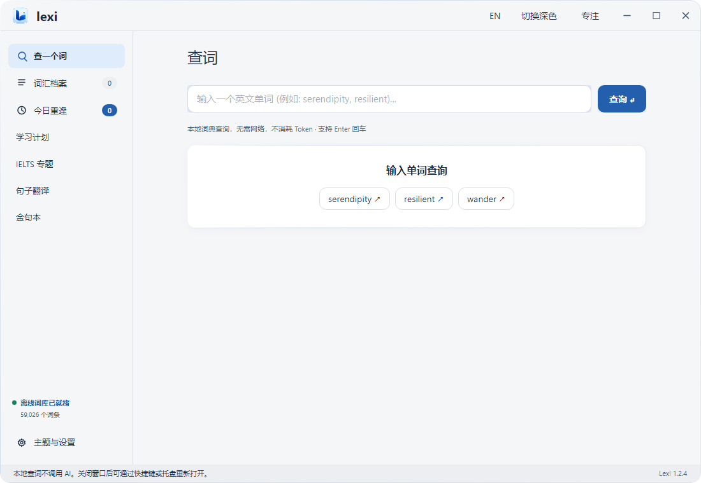
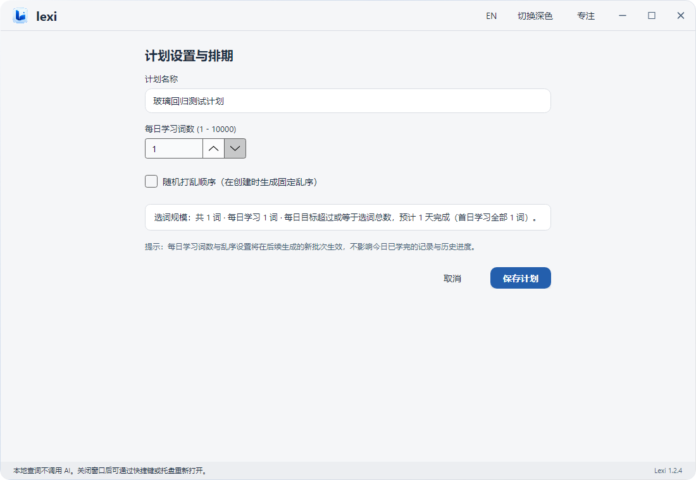

<div align="center">

# Lexi

**本地优先的英语词汇管理与学习工具**

从查词、积累到复习，在自己的词汇档案中建立持续学习的路径。

[](https://github.com/Cofran-77/lexi/actions/workflows/build.yml)
[](LICENSE)
[](windows/README.md)
[](android/README.md)

[下载](https://github.com/Cofran-77/lexi/releases) · [构建指南](docs/BUILDING.md) · [更新日志](CHANGELOG.md) · [问题反馈](https://github.com/Cofran-77/lexi/issues)

**Cofran-77 · DespairJasper**

</div>

Lexi 面向希望持续积累英语词汇的学习者，将离线词典、个人词汇档案与复习流程整合在一起。词条不仅记录释义，也能保存遇见它的原句、来源和备注，让复习回到实际语境。AI 是可选的扩展能力：用户自行配置服务，在需要时生成内容，基础查词和本地档案无需 API 密钥。

本仓库提供 Windows 与 Android 的完整应用源码，macOS 目录预留用于合作接入。各平台独立实现、独立发布；当前不提供账号系统或跨端自动云同步。

## 平台与安装

| 平台 | 当前应用版本 | 运行要求 | 发布状态 |
| --- | --- | --- | --- |
| Windows | 1.2.4 | Windows 10 / 11，x64 | 桌面版；提供自包含安装程序 |
| Android | 0.2.2-alpha | Android 8.0 及以上 | 原生预览版；提供可直接安装的 APK |
| macOS | 尚未接入 | 待合作作者补充 | 本目录暂无源码或安装包 |

在 [Releases](https://github.com/Cofran-77/lexi/releases) 选择当前发布。Windows 安装包包含 .NET 运行环境，无需额外安装；更新前请完全退出托盘并备份档案。Android 提供沿用原开发签名的 APK；安装前请备份，卸载会删除应用私有数据。构建与签名说明见平台文档。

**直接下载：[Windows 安装程序](https://github.com/Cofran-77/lexi/releases/download/windows-v1.2.4-nc.1/Lexi-1.2.4-nc.1-x64-setup.exe) · [Android APK](https://github.com/Cofran-77/lexi/releases/download/android-v0.2.2-nc.1/Lexi-Android-0.2.2-alpha.apk)**。无需自行编译。各包适用许可见独立许可说明。

本次许可修订不改变应用版本或学习功能。最新版包含个人学习所需的完整程序实现与离线词典；第三方教材数据不随包分发，详见下方资源说明。

## 主要功能

### 查词与词汇档案

- 内置 ECDICT 常用词子集，共 59,026 条，支持离线查询。
- 保存音标、释义、来源原句、备注、标签及已保存的 AI 内容。
- 支持词条编辑、筛选、批量管理和数据导出。
- Windows 提供全局快捷查词；Android 可通过系统选中文字菜单或分享入口接收词句。

### 复习与学习

- **今日重逢**：先回忆，再揭晓释义并记录熟悉程度。
- **Windows**：FSRS-6 自适应排期，根据学习历史、难度、记忆稳定性与目标保持率安排复习；个人参数训练由 Rust 助手完成，数据不足时使用默认参数。
- **Android**：当前采用第 1、2、4、7、15 天的固定日期排期。
- Windows 还提供每日计划、辅助拼写、全局专注学习、可配置快捷键与朗读。

### 语境与句子积累

Windows 提供句子翻译与金句本，可将例句、译文和语境纳入个人积累。可选 AI 功能支持例句、近反义词与常用词组等内容生成，兼容用户自行配置的 OpenAI 风格接口。请求由用户主动发起，服务费用由用户所配置的账户承担。

### 数据管理

支持 CSV 词条迁移、旧版 JSON 导入及各端本地备份。Windows 提供打印与导出工具；Android 支持 A4 PDF 导出和系统打印。

CSV 用于词条交换，不保证迁移全部计划、会话或复习历史。两端 SQLite 数据库不能直接互相覆盖。迁移前请阅读 [数据与迁移说明](docs/DATA_AND_MIGRATION.md)。

## 界面预览





以上截图使用隔离演示数据；第三方教材内容的可用性取决于用户合法导入的资源。

## 开始使用

1. 安装对应平台版本，直接离线查词。
2. 将需要学习的词保存到词汇档案，补充原句、来源或标签。
3. 在今日重逢中复习；Windows 可进一步建立每日计划或使用专注模式。
4. 如需生成语境内容，在设置中配置自己的 AI 接口与模型。
5. 定期导出或备份，尤其是在升级、恢复数据库与更换签名前。

## 开发与构建

| 平台 | 技术栈 | 开发工具 |
| --- | --- | --- |
| Windows | C#、Avalonia、SQLite、Rust FSRS 助手 | .NET SDK 8、Rust 1.85+；安装程序使用 NSIS 3 |
| Android | Kotlin、Jetpack Compose、SQLite | JDK 17、Android SDK 35、Gradle Wrapper 8.9 |

```powershell
git clone https://github.com/Cofran-77/lexi.git
cd lexi
cargo build --manifest-path windows/native/fsrs-optimizer/Cargo.toml --release --locked
dotnet run --project windows/Lexi.csproj
```

```sh
cd android
chmod +x gradlew
./gradlew assembleDebug
```

完整环境、安装包构建和签名说明见 [构建指南](docs/BUILDING.md)。工程编译工作流用于检查可构建性，不替代真机适配或功能验收。

## 项目结构与文档

```text
windows/     Windows 应用、学习算法、测试与打包工具
android/     Android 应用、Gradle Wrapper 与测试
macos/       macOS 合作接入说明
docs/        架构、数据、隐私、资源与版本文档
.github/     编译工作流与 Issue / PR 模板
```

- [系统架构](docs/ARCHITECTURE.md)
- [数据格式与迁移](docs/DATA_AND_MIGRATION.md)
- [隐私说明](docs/PRIVACY.md)
- [资源接入](docs/RESOURCES.md)
- [版本历史与源码来源](docs/VERSION_HISTORY.md)
- [贡献指南](CONTRIBUTING.md)

历史归档包含 11 个 Windows、6 个 Android 源码快照；重要节点通过平台前缀标签保留。归档来源和重建方式见版本历史文档。

## 专题学习与资料

Windows 提供专题词汇、辅助拼写、听力与语法资料、写作练习工作区。离线词典随安装包提供；专题教材需另行接入。第三方内容的来源、获取方式与接入格式见 [资源指南](docs/RESOURCES.md) 和 [第三方声明](THIRD_PARTY_NOTICES.md)。

## 许可

本次修订起，项目原创代码与文档以 **[PolyForm Noncommercial 1.0.0](LICENSE)** 提供，作者为 **Cofran-77 和 DespairJasper**。允许许可条款规定的非商业使用、修改与分发；商业使用需另获相关权利人的书面授权。作者保留未来商业授权与产品发行权利。第三方代码和资源继续遵循各自许可。

本项目属于**源码可用的非商业项目**。当前许可的适用范围、历史授权及第三方权利见 [许可政策与沿革](LICENSE-POLICY.md)。

## 作者与致谢

[Cofran-77](https://github.com/Cofran-77) · [DespairJasper](https://github.com/DespairJasper)

感谢 [ECDICT](https://github.com/skywind3000/ECDICT)、[Open Spaced Repetition / FSRS](https://github.com/open-spaced-repetition)、Avalonia、.NET、AndroidX 与 Jetpack Compose 等项目。macOS 合作参考项目为 [DespairJasper/lexi-macos](https://github.com/DespairJasper/lexi-macos)，其授权以该仓库自身声明为准。
